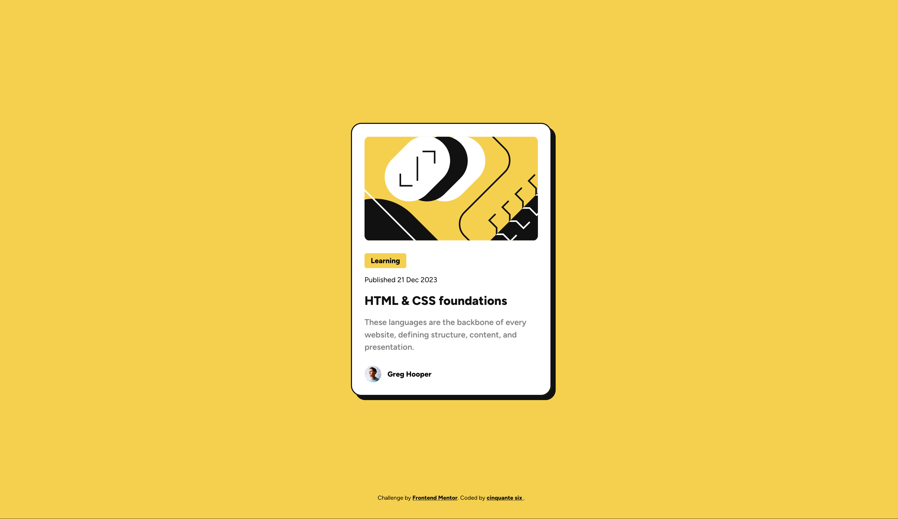

# Frontend Mentor - Blog preview card solution

This is a solution to the [Blog preview card challenge on Frontend Mentor](https://www.frontendmentor.io/challenges/blog-preview-card-ckPaj01IcS). Frontend Mentor challenges help you improve your coding skills by building realistic projects. 

## Table of contents

- [Overview](#overview)
  - [The challenge](#the-challenge)
  - [Screenshot](#screenshot)
  - [Links](#links)
- [My process](#my-process)
  - [Built with](#built-with)
  - [What I learned](#what-i-learned)
  - [Continued development](#continued-development)
  - [Useful resources](#useful-resources)
- [Author](#author)

**Note: Delete this note and update the table of contents based on what sections you keep.**

## Overview

### The challenge

Users should be able to:

- See hover and focus states for all interactive elements on the page

### Screenshot



### Links

- Solution URL: [Blog preview card](https://github.com/Cinquantesix/FM-2407-blog-preview-card-main)
- Live Site URL: [Blog preview card](https://fm-2407-blog-preview-card-main.netlify.app/)

## My process

### Built with

- Semantic HTML5 markup
- CSS custom properties
- Flexbox

### What I learned

I learn a know kind of value for ```width:```, ```fit-content```. Thank [@gmagnenat](https://github.com/gmagnenat) for that. I didn't know the child will take all the width in a flex column…

### Continued development

I really liked the way of thinking that I don't need ```@media (…) {…}``` to be 100% responsive. That will be really helpful for next projects.

### Useful resources

- [@fontface](https://www.w3schools.com/csSref/css3_pr_font-face_rule.php) - If your are like me an you always forgot how to link fonts…

## Author

- Website - [cinquantesix](https://cinquantesix.ch)
- Frontend Mentor - [@Cinquantesix](https://www.frontendmentor.io/profile/Cinquantesix)
